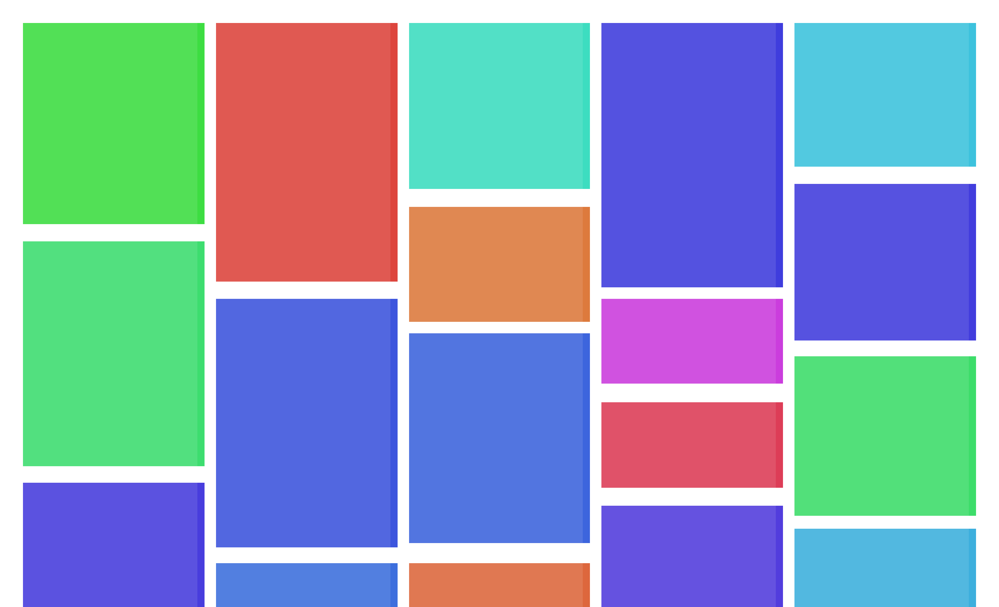

# Svelte Masonry Layout

A simple package that provides a *masonry*-based grid **component** with horizontal order. If you're not familiar, the **masonry** layout is a way to display items in a grid where the items doesn't necessary have the same height (or width), sort of like bricks in a wall. For example:



## Getting Started

### Installation

Install with npm

```bash
npm install svelte-masonry-layout
```

### Basic Usage

```svelte
<script>
   import MasonryLayout from 'svelte-masonry-layout';

   let items = [
      {
         image: '...',
         title: 'Hello world!', 
         description: 'Lorem ipsum dolor sit...'
      },
      ...
   ]
</script>

<MasonryLayout {items} gap="10px">
   {#each items as item}
      <div class="item">
         <span class="title">{item.title}</span>
         
         <p class="content">{item.content}</p>
      </div>
   {/each}
</MasonryLayout>
```

### Updating the grid

Sometimes, you need to load more items as the user scrolls through the page, and therefore, update the grid items as needed. When you pass an `items` property for the `MansonryLayout` component, the grid will update every time the `items` changes, thanks to svelte's reactivity.

Maybe you want to manually update the grid after some change in the items, so you can use the following strategy:

```svelte
<script>
   import MasonryLayout from 'svelte-masonry-layout';

   let items = [
      {
         image: '...',
         title: 'Hello world!', 
         description: 'Lorem ipsum dolor sit...'
      },
      ...
   ]
   // this function will only update the grid
   // after the MansonryLayout component has been initialized
   let upateGrid = () => {}

   waitForSomeExternApi()
      .then((data) => {
         performeSomeChanges(data)
         updateGrid()
      })
</script>

<!-- We use bind:updateGrid to be able to access the updateGrid function -->
<MasonryLayout gap="10px" bind:updateGrid>
   {#each items as item}
      <div class="item">
         <span class="title">{item.title}</span>
         
         <p class="content">{item.content}</p>
      </div>
   {/each}
</MasonryLayout>
```

### Number of columns and breakpoints

Sometimes you want to display a different number of columns based on the width of the viewport. Similar to the [react-masonry-css](https://github.com/paulcollett/react-masonry-css) package, you can pass a `breakpointsCols` object to the `MasonryLayout` component indicating the number of columns for various breakpoints.

For example:

```svelte
<script>
   ...
</script>

<MasonryLayout
   breakpointCols={{
      // breakpoint (in px) : number of columns
      default: 5, // display 5 columns by default
      400:  1, // until 400px, display 1 column
      600:  2, // until 600px, display 2 columns
      800:  3, // until 800px, display 3 columns
      1000: 4, // until 1000px, display 4 columns
   }}
>
   ...
</MasonryLayout>
```

## License

MIT License

Copyright (c) 2022 Jorge Brito

Permission is hereby granted, free of charge, to any person obtaining a copy
of this software and associated documentation files (the "Software"), to deal
in the Software without restriction, including without limitation the rights
to use, copy, modify, merge, publish, distribute, sublicense, and/or sell
copies of the Software, and to permit persons to whom the Software is
furnished to do so, subject to the following conditions:

The above copyright notice and this permission notice shall be included in all
copies or substantial portions of the Software.

THE SOFTWARE IS PROVIDED "AS IS", WITHOUT WARRANTY OF ANY KIND, EXPRESS OR
IMPLIED, INCLUDING BUT NOT LIMITED TO THE WARRANTIES OF MERCHANTABILITY,
FITNESS FOR A PARTICULAR PURPOSE AND NONINFRINGEMENT. IN NO EVENT SHALL THE
AUTHORS OR COPYRIGHT HOLDERS BE LIABLE FOR ANY CLAIM, DAMAGES OR OTHER
LIABILITY, WHETHER IN AN ACTION OF CONTRACT, TORT OR OTHERWISE, ARISING FROM,
OUT OF OR IN CONNECTION WITH THE SOFTWARE OR THE USE OR OTHER DEALINGS IN THE
SOFTWARE.